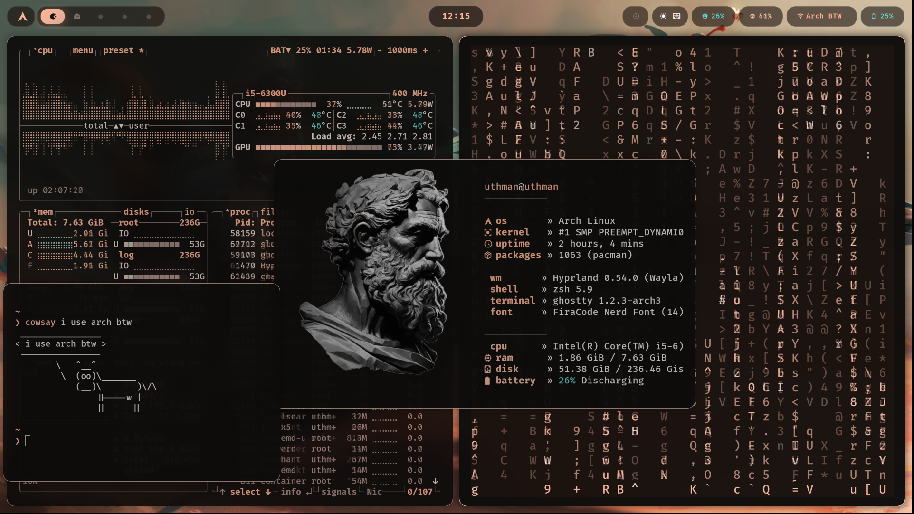

# dotfiles

> Arch Linux · Hyprland · Matugen — dynamic wallpaper-based theming



---

## What is this

A minimal, dynamic rice for Arch Linux using Hyprland as the compositor.
Colors are generated automatically from any wallpaper via **Matugen** — change
your wallpaper and every app recolors itself to match.

Built on top of [Omarchy](https://omarchy.org) with custom configs layered over
the defaults.

**Stack:**
- **WM:** Hyprland (Wayland)
- **Bar:** Waybar (glassmorphic floating islands)
- **Terminal:** Ghostty
- **Shell:** Zsh + Starship prompt
- **Theming:** Matugen (Material You color extraction)
- **Notifications:** SwayNC
- **Launcher:** Walker
- **Visualizer:** Cava
- **System monitor:** btop
- **Fetch:** Fastfetch

---

## Dependencies

Install everything with:

```bash
yay -S hyprland waybar ghostty matugen starship zsh lsd zoxide fzf \
       cava btop wl-screenrec walker swaync stow \
       ttf-firacode-nerd hyprlock hypridle hyprsunset \
       xdg-desktop-portal-hyprland uwsm
```

---

## Install

```bash
git clone https://github.com/codetesla51/uthman_dotfiles.git ~/dotfiles
cd ~/dotfiles
chmod +x install.sh
./install.sh
```

The installer will:
1. Check for missing dependencies (warns, does not exit)
2. Create `~/.config/theme/current/` and `~/.config/theme/themes/snow_black/`
3. Copy fallback colors so the rice works immediately
4. Create integration symlinks for btop and cava themes
5. Back up any existing config files that would conflict, then symlink everything via GNU Stow
6. Optionally run `matugen` to generate colors from your wallpaper

> **Existing configs** are automatically backed up to `~/.config-backup-<timestamp>/` before stowing.

---

## How theming works

Matugen reads a wallpaper image and generates a full Material You color palette,
then writes color variables to every app's config via templates.

**Apply a new wallpaper and regenerate all colors:**

```bash
matugen image ~/Pictures/your-wallpaper.jpg
```

**Color output locations:**
- `~/.config/theme/current/` — active colors (written by matugen)
- `~/.config/theme/themes/snow_black/` — saved snapshot of the snow_black theme
- `~/.config/waybar/colors.css` — waybar color variables (auto-updated)

**Template files** live in `~/.config/matugen/templates/` — one per app.
Matugen fills in `{{ colors.primary.default.hex }}` style variables and writes
the result to each app's config directory.

**Apps themed by matugen:**
Waybar, Hyprlock, Ghostty, btop, Cava, Walker, SwayNC, GTK, Firefox, Chromium, Mako

---

## Structure

```
~/dotfiles/
├── .config/
│   ├── ghostty/         # Terminal config
│   ├── waybar/          # Bar + scripts
│   ├── hypr/
│   │   └── hyprlock.conf  # Lock screen config
│   ├── fastfetch/       # Fetch config
│   ├── cava/            # Audio visualizer
│   ├── btop/            # System monitor
│   ├── swaync/          # Notification center
│   ├── starship.toml
│   └── matugen/
│       ├── config.toml  # Template paths and matugen settings
│       └── templates/   # Per-app color templates
├── .zshrc
├── Pictures/
│   └── logo.png         # Fastfetch logo
├── wallpapers/          # Wallpaper collection
├── theme-fallback/      # Static snow_black colors (used before matugen runs)
├── screenshot.png
├── install.sh
└── README.md
```

---

## Note on Omarchy

This rice is built on top of [Omarchy](https://omarchy.org). Hyprland default
bindings, envs, and window rules are sourced from Omarchy's system files at
`~/.local/share/omarchy/default/hypr/`. If you are not using Omarchy, you will
need to supply your own `hyprland.conf`.

---

## Credits

- [Omarchy](https://omarchy.org) — Arch Linux + Hyprland distribution
- [Matugen](https://github.com/InioX/matugen) — Material You color generation
- [Hyprland](https://hyprland.org) — Wayland compositor
- [Waybar](https://github.com/Alexays/Waybar) — Status bar
- [Starship](https://starship.rs) — Shell prompt
- [FiraCode Nerd Font](https://github.com/ryanoasis/nerd-fonts) — Font
